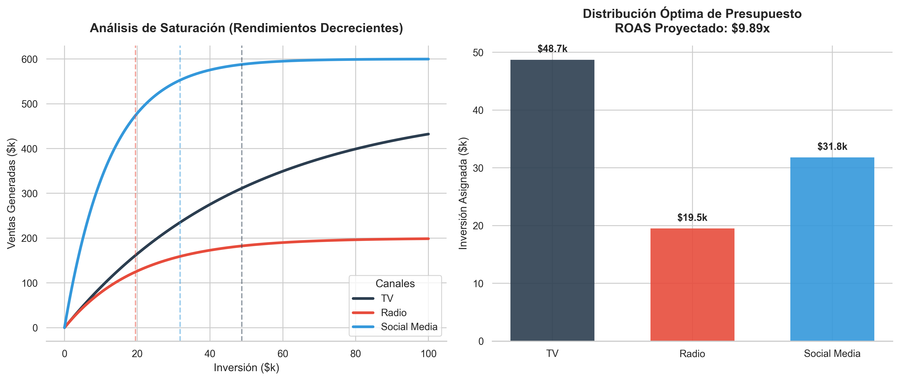

# Marketing Mix Modeling (MMM) & ROAS Optimization 🚀

Este repositorio contiene un motor de optimización matemática diseñado para maximizar el **ROAS (Return on Ad Spend)** en campañas publicitarias multicanal, aplicando principios de rendimientos decrecientes y saturación de mercado.

A diferencia de los modelos de atribución lineal, este pipeline utiliza optimización no lineal con restricciones para encontrar la asignación de presupuesto perfecta que maximiza las ventas totales.

##  Enfoque Matemático: Curvas de Saturación

En la publicidad real, invertir el doble no garantiza vender el doble. Para modelar el comportamiento real de los canales (TV, Radio, Social Media), el algoritmo utiliza una **Curva Exponencial de Rendimientos Decrecientes**:

$$Ventas = \alpha \cdot (1 - e^{-\lambda \cdot Inversión})$$

* **$\alpha$ (Alpha):** Representa el techo máximo (límite asintótico) de ventas que un canal puede generar sin importar cuánta inversión se inyecte.
* **$\lambda$ (Lambda):** Representa la velocidad a la que el canal se satura.

## ⚙️ Motor de Optimización

El núcleo del sistema utiliza `scipy.optimize` (Sequential Least Squares Programming - SLSQP) para resolver el problema de asignación:
* **Función Objetivo:** Maximizar el total de ventas proyectadas.
* **Restricción:** El presupuesto asignado a la suma de los canales debe ser exactamente igual al presupuesto fijo disponible (ej. $100k).
* **Límites:** Ningún canal puede tener una inversión negativa.

##  Resultado Visual y Toma de Decisiones

El script genera un panel analítico dual que permite a los directores de marketing entender no solo **cuánto** invertir, sino **por qué**:

1. **Panel Izquierdo:** Muestra la curva de saturación de cada canal. Las líneas punteadas indican exactamente el punto óptimo donde el algoritmo detuvo la inversión antes de que el retorno marginal se volviera ineficiente.
2. **Panel Derecho:** Muestra la distribución exacta de capital sugerida y el multiplicador de ROAS proyectado para la campaña.

##  Stack Tecnológico
* **Python 3**
* **SciPy** (SLSQP Optimization)
* **NumPy** (Cálculo Matricial)
* **Seaborn & Matplotlib** (Data Visualization)

---
*Desarrollado por Wilson Andres Lombardo - Matemático y Data Scientist.*
